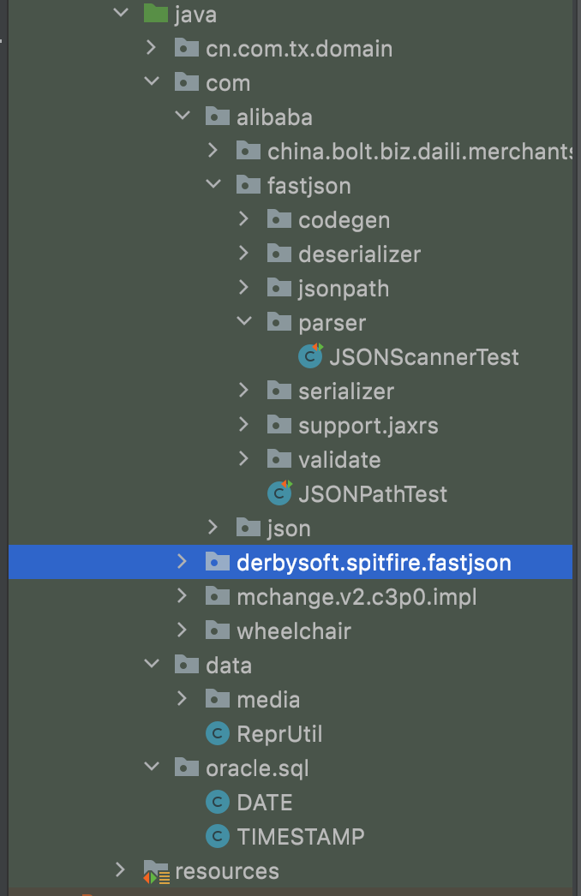

(3) Document the existing test cases (JUnit or otherwise). This should be a study of the existing testing practices and frameworks that are used already in the system. (This section might evolve as we learn more throughout the quarter.) How do you run them?

- This project is using JUnnit to do unit test, and using maven to manage the dependency and build. So all the test are written under the "test" folder, all the part that need to be tested has a corresponding test file.

- We can run the test case individually under IDE, or we can run the test cases using maven under the terminal\
   ```mvn test```   run all the test case\
  ```mvn -Dtest=TestCaseName```  run single test case

- We can also build the project using maven\
    ```mvn package```    